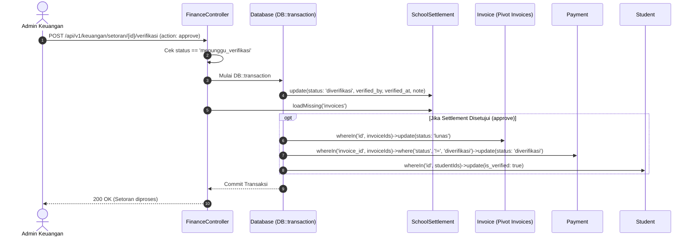
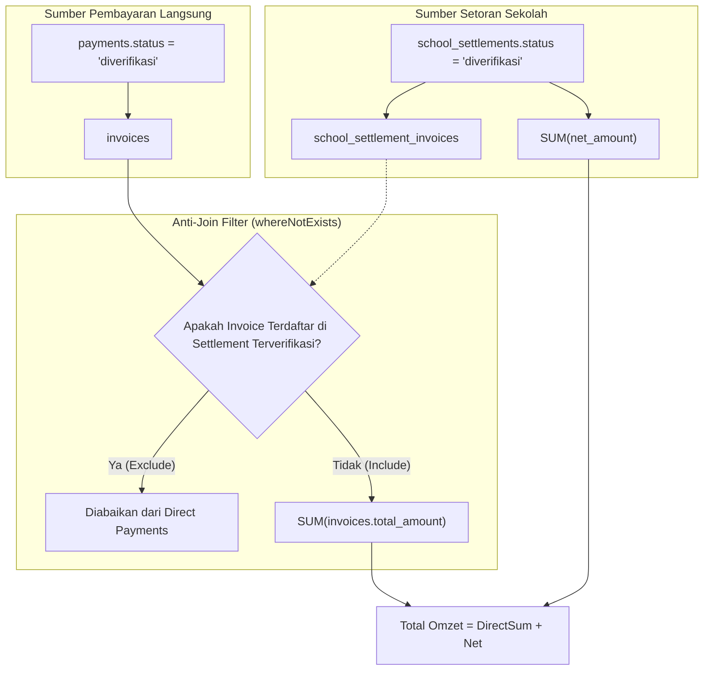
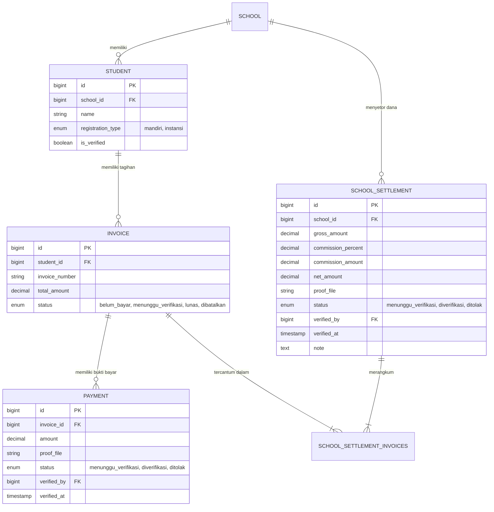

# Dokumentasi Teknis Phase 2: Rekonsiliasi Finansial & Dashboard Pendapatan

Dokumen ini menjelaskan arsitektur, mekanisme transaksional, pencegahan anomali data, dan resolusi agregasi pendapatan yang diimplementasikan pada **Phase 2 (Finance Reconciliation & Revenue Aggregation)** di Robotiku ERP Backend.

---

## 1. Latar Belakang & Identifikasi Masalah

Sebelum penyelesaian Phase 2, terdapat dua permasalahan krusial pada modul finansial dan dashboard eksekutif keuangan:

### 1.1. Siklus Hidup Pembayaran Sekolah Terputus (*Disconnected Settlement Lifecycle*)
Pada pendaftaran jalur instansi/sekolah (`registration_type = 'instansi'`), tagihan siswa dikolektifkan oleh pihak sekolah, lalu pihak sekolah menyetorkan dana kolektif ke Robotiku melalui entitas setoran sekolah (`SchoolSettlement`).

Ketika staf keuangan menyetujui (*approve*) setoran sekolah di endpoint verifikasi:
1. **Invoice tidak terbarui:** Status `invoices.status` tetap berada pada `belum_bayar`.
2. **Payment menggantung:** Record `payments.status` yang diunggah pihak sekolah tetap berstatus `menunggu_verifikasi`.
3. **Siswa tidak terverifikasi:** Field `students.is_verified` tetap `false` (0), menghambat aktivasi akun siswa untuk mengikuti sesi kelas robotika.
4. **Resiko Penagihan Ganda:** Karena invoice tetap berstatus `belum_bayar`, sistem reminder tagihan WhatsApp (`BillingReminderController`) masih berpotensi mengirimkan notifikasi penagihan kepada sekolah/orang tua untuk tagihan yang sebenarnya sudah lunas.

### 1.2. Omisi Setoran Sekolah & Resiko *Double-Counting* pada Dashboard Keuangan
Pada service analitik keuangan (`KeuanganDashboardService`):
1. **Omisi Pendapatan Setoran:** Metrik pendapatan (`pendapatan_bulan_ini`, `pendapatan_tahun_ini`, dan grafik tren `pendapatan_per_bulan`) sebelumnya hanya menjumlahkan pembayaran langsung dari relasi `Invoice` dan `Payment` yang berstatus `diverifikasi`. Dana yang masuk dari setoran mitra sekolah (`SchoolSettlement`) sama sekali tidak dihitung ke dalam total pendapatan perusahaan.
2. **Resiko Perhitungan Ganda (*Double-Counting*):** Apabila pendapatan setoran sekolah ditambahkan begitu saja tanpa filtering khusus, invoice yang pembayarannya diverifikasi secara langsung dan sekaligus dimasukkan ke dalam setoran sekolah akan dihitung dua kali (nilai kotor invoice + nilai bersih setoran).
3. **Inkompatibilitas Driver Database:** Query agregasi bulanan (`GROUP BY month`) menggunakan sintaks SQL yang berbeda antara lingkungan pengujian CI/CD (SQLite) dan lingkungan staging/production (MySQL), sehingga berisiko menimbulkan kegagalan query SQL (*syntax error*).

---

## 2. Resolusi Transaksional: `FinanceController::verifySettlement`

Penyelesaian masalah dilakukan dengan menerapkan pembaruan transaksional berjenjang (*cascading atomic updates*) di dalam method `verifySettlement`.

### 2.1. Spesifikasi Endpoint

| Properti | Detail |
|---|---|
| **Route** | `POST /api/v1/keuangan/setoran/{settlement}/verifikasi` |
| **Handler** | `App\Http\Controllers\Api\V1\Keuangan\FinanceController::verifySettlement` |
| **Middleware** | `auth:sanctum`, `role:admin_keuangan,admin,super_admin` |
| **Payload** | `action` (`required|in:approve,reject`), `note` (`nullable|string`) |

### 2.2. Pencegahan *Race Condition* & *Idempotency Guard*

Sebelum membuka transaksi database, controller memvalidasi state awal `SchoolSettlement` untuk memastikan operasi bersifat idempoten dan terhindar dari *race condition* akibat klik ganda (*double-submit*) oleh operator keuangan:

```php
if ($settlement->status !== 'menunggu_verifikasi') {
    return $this->error('Setoran sudah diproses sebelumnya.', 422);
}
```

Jika setoran telah diproses (`diverifikasi` atau `ditolak`) oleh sesi lain, permintaan berikutnya langsung ditolak dengan status HTTP `422 Unprocessable Content`.

### 2.3. Transaksi Atomik Database (`DB::transaction`)

Seluruh cascading mutasi dibungkus dalam blok `DB::transaction` untuk menjamin konsistensi data (*ACID compliance*). Jika terjadi kegagalan pada salah satu tahap pembaruan entitas anak, seluruh perubahan akan di-rollback.



#### Rincian Mutasi saat Disetujui (`action === 'approve'`):
1. **Update Setoran Sekolah (`SchoolSettlement`):**
   - `status`: `'diverifikasi'`
   - `verified_by`: ID user staf keuangan yang sedang login (`$r->user()->id`)
   - `verified_at`: `now()`
   - `note`: Catatan verifikasi opsional.
2. **Update Status Tagihan (`Invoice`):**
   - Mengambil seluruh relasi invoice terkait melalui pivot `school_settlement_invoices`.
   - Mengubah status seluruh invoice menjadi `'lunas'`:
     ```php
     $invoiceIds = $settlement->invoices->pluck('id');
     if ($invoiceIds->isNotEmpty()) {
         Invoice::whereIn('id', $invoiceIds)->update(['status' => 'lunas']);
     }
     ```
3. **Update Status Pembayaran (`Payment`):**
   - Menandai semua record payment terkait yang belum diverifikasi menjadi `'diverifikasi'`:
     ```php
     Payment::whereIn('invoice_id', $invoiceIds)
         ->where('status', '!=', 'diverifikasi')
         ->update([
             'status' => 'diverifikasi',
             'verified_at' => now(),
             'verified_by' => $r->user()->id,
         ]);
     ```
4. **Verifikasi Status Siswa (`Student`):**
   - Mengambil daftar unik ID siswa dari invoice:
     ```php
     $studentIds = $settlement->invoices->pluck('student_id')->filter()->unique();
     if ($studentIds->isNotEmpty()) {
         Student::whereIn('id', $studentIds)->update(['is_verified' => true]);
     }
     ```

#### Perilaku saat Ditolak (`action === 'reject'`):
- Status `SchoolSettlement` diperbarui menjadi `'ditolak'`.
- Status `Invoice` tetap dipertahankan (`belum_bayar`).
- Rekord `Payment` dan status `Student` tidak diubah, memungkinkan admin sekolah memperbaiki bukti setoran atau nominal transfer yang keliru.

---

## 3. Resolusi Agregasi Pendapatan: `KeuanganDashboardService`

Modul dashboard eksekutif (`KeuanganDashboardService`) bertanggung jawab menyajikan metrik pendapatan bersih yang akurat secara *real-time*.

### 3.1. Formula Perhitungan Pendapatan Bersih

Pendapatan perusahaan dihitung dari dua komponen utama:

$$\text{Total Pendapatan} = \text{Direct Payments (Non-Settled)} + \text{Verified School Settlements (Net Amount)}$$

> [!IMPORTANT]
> **Mengapa Menggunakan `net_amount` pada Setoran Sekolah?**  
> Pada pendaftaran kolektif instansi, sekolah berhak atas bagi hasil komisi (`commission_percent`). Nilai yang disetorkan dan masuk ke rekening perusahaan adalah **Net Amount** (`gross_amount - commission_amount`). Menggunakan `gross_amount` akan menghasilkan *overstated revenue* (penggelembungan omzet semu).

### 3.2. Pencegahan *Double-Counting* Menggunakan Anti-Join `whereNotExists`

Untuk mencegah tagihan yang dibayar melalui setoran sekolah dihitung dua kali (sekali pada tabel `payments` dan sekali lagi pada tabel `school_settlements`), query pembayaran langsung dilengkapi dengan klausa **anti-join** `whereNotExists`:

```php
private function pendapatan(Carbon $start, Carbon $end): float
{
    $directPayments = (float) Invoice::query()
        ->join('payments', 'invoices.id', '=', 'payments.invoice_id')
        ->where('payments.status', 'diverifikasi')
        ->whereBetween('payments.verified_at', [$start, $end])
        ->whereNotExists(function ($query) {
            $query->select(DB::raw(1))
                ->from('school_settlement_invoices')
                ->join('school_settlements', 'school_settlement_invoices.school_settlement_id', '=', 'school_settlements.id')
                ->whereColumn('school_settlement_invoices.invoice_id', 'invoices.id')
                ->where('school_settlements.status', 'diverifikasi');
        })
        ->sum('invoices.total_amount');

    $settlements = (float) SchoolSettlement::query()
        ->where('status', 'diverifikasi')
        ->whereBetween('verified_at', [$start, $end])
        ->sum('net_amount');

    return $directPayments + $settlements;
}
```



**Mekanisme Kerja Anti-Join:**
1. Jika invoice berasal dari **pembayaran mandiri orang tua** (tidak pernah masuk setoran sekolah), invoice akan dihitung melalui `$directPayments`.
2. Jika invoice berasal dari **setoran sekolah yang sudah diverifikasi**, invoice dieksklusikan dari `$directPayments` karena pendapatannya sudah direpresentasikan oleh `$settlements` (`net_amount`).
3. Jika invoice pernah diajukan ke setoran sekolah namun setoran berstatus `ditolak` atau `menunggu_verifikasi`, invoice tidak dieksklusikan dari pembayaran langsung sampai setoran tersebut benar-benar disahkan.

### 3.3. Agregasi Tren Bulanan Multi-Driver (`pendapatanPerBulan`)

Fungsi `pendapatanPerBulan()` merangkum tren pendapatan 12 bulan terakhir. Karena perbedaan fungsi manipulasi tanggal antar RDBMS:
- **SQLite (Unit Testing & CI):** Memerlukan fungsi `strftime('%Y-%m', column)`.
- **MySQL / MariaDB (Staging & Production):** Memerlukan fungsi `DATE_FORMAT(column, '%Y-%m')`.

Sistem mendeteksi driver koneksi secara dinamis menggunakan `DB::connection()->getDriverName()`:

```php
$driver = DB::connection()->getDriverName();
$monthExprPayments = $driver === 'sqlite'
    ? "strftime('%Y-%m', payments.verified_at)"
    : "DATE_FORMAT(payments.verified_at, '%Y-%m')";

$monthExprSettlements = $driver === 'sqlite'
    ? "strftime('%Y-%m', school_settlements.verified_at)"
    : "DATE_FORMAT(school_settlements.verified_at, '%Y-%m')";
```

#### Normalisasi Linimasa 12 Bulan (Zero-Filled Timeline):
Untuk mencegah hilangnya data bulan yang tidak memiliki transaksi (yang dapat merusak grafik kurva tren di frontend), service melakukan perulangan kursor kalender dari `$start` hingga `$end`:

```php
$result = [];
$cursor = $start->copy();

while ($cursor <= $end) {
    $key = $cursor->format('Y-m');

    $pTotal = isset($directPayments[$key]) ? (float) $directPayments[$key]->total : 0;
    $sTotal = isset($settlements[$key]) ? (float) $settlements[$key]->total : 0;

    $result[] = [
        'month' => $cursor->translatedFormat('M'),
        'total' => $pTotal + $sTotal,
    ];
    $cursor->addMonth();
}
```

Hasilnya adalah array 12 elemen terurut kronologis dengan nilai `total` terisi angka desimal `0` apabila tidak ada transaksi pada bulan terkait.

---

## 4. Diagram Entitas & Relasi Data (ERD)

Berikut adalah relasi antar-entitas yang terlibat dalam siklus rekonsiliasi finansial:



---

## 5. Ringkasan Respons & Kontrak API Dashboard

Panggilan endpoint `GET /api/v1/keuangan/dashboard` menghasilkan envelope respons standar:

```json
{
  "status": true,
  "data": {
    "pendapatan_bulan_ini": 500000.0,
    "pendapatan_bulan_ini_label": "Pendapatan Bulan Ini",
    "pendapatan_tahun_ini": 1500000.0,
    "tagihan_outstanding": 300000.0,
    "rata_rata_komisi": 17.5,
    "sekolah_aktif": 12,
    "menunggu_verifikasi": 3,
    "menunggu_verifikasi_route": "/admin/keuangan/verifikasi",
    "pendapatan_per_bulan": [
      { "month": "Okt", "total": 250000.0 },
      { "month": "Nov", "total": 400000.0 },
      { "month": "Des", "total": 0.0 },
      { "month": "Jan", "total": 500000.0 }
    ],
    "status_pembayaran_global": {
      "belum_bayar": 4,
      "lunas": 28
    },
    "tagihan_outstanding_per_sekolah": [
      { "school_name": "SDN 1 Mentari", "total": 300000.0 }
    ],
    "komisi_per_sekolah": [
      { "school_name": "SDN 1 Mentari", "commission_percent": 15.0 }
    ],
    "setoran_terbaru": [
      {
        "school_name": "SDN 1 Mentari",
        "net_amount": 850000.0,
        "created_at": "2026-09-25T14:30:00+07:00",
        "status": "diverifikasi"
      }
    ]
  },
  "message": "Data dashboard keuangan berhasil dimuat."
}
```

---

## 6. Verifikasi & Pengujian Otomatis

Seluruh logika rekonsiliasi dan dashboard dicakup oleh rangkaian pengujian otomatis Feature Test:

### 6.1. Eksekusi Pengujian

Jalankan perintah berikut pada terminal:
```bash
php artisan test tests/Feature/Keuangan/SettlementVerificationTest.php tests/Feature/Keuangan/KeuanganDashboardTest.php
```

### 6.2. Skenario Uji Kunci

| File Test | Kasus Uji | Skenario Validasi |
|---|---|---|
| `SettlementVerificationTest` | `test_admin_keuangan_can_approve_settlement_and_invoices_become_lunas` | Memastikan setoran disetujui, invoice menjadi `lunas`, payment menjadi `diverifikasi`, dan siswa menjadi `is_verified = true`. |
| `SettlementVerificationTest` | `test_admin_keuangan_can_reject_settlement` | Memastikan penolakan setoran tidak mengubah invoice dan payment menjadi lunas. |
| `SettlementVerificationTest` | `test_already_processed_settlement_cannot_be_verified_again` | Memastikan proteksi idempotency mengembalikan HTTP 422 jika setoran telah diproses sebelumnya. |
| `SettlementVerificationTest` | `test_non_finance_user_cannot_verify_settlement` | Memastikan role unauthorized (misal: `marketing`) ditolak dengan HTTP 403. |
| `KeuanganDashboardTest` | `test_dashboard_revenue_includes_verified_school_settlements` | Memastikan omzet menggabungkan pembayaran langsung mandiri + `net_amount` setoran sekolah. |
| `KeuanganDashboardTest` | `test_dashboard_avoids_double_counting_invoice_when_settled` | Memastikan invoice yang sudah disetor via settlement tidak dihitung ganda. |
| `KeuanganDashboardTest` | `test_dashboard_with_period_filter` & `test_dashboard_with_custom_date_range` | Memastikan filter periode (`minggu_ini`, `3_bulan`, rentang tanggal kustom) berjalan akurat. |
