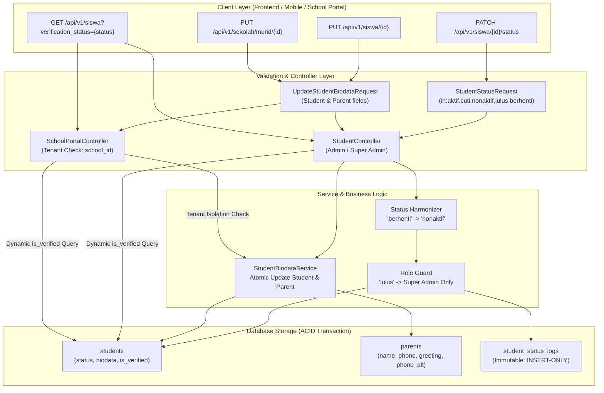

# Dokumentasi Teknis Phase 3: Siklus Hidup Siswa (Status, Biodata, & Filter Visibilitas)

Dokumen ini menjelaskan arsitektur, mekanisme transaksional harmonisasi status, pencatatan audit trail *immutable*, pembaruan biodata siswa & orang tua melalui service terpusat, pengamanan *multi-tenant isolation*, serta filter visibilitas dinamis yang diimplementasikan pada **Phase 3 (Student Lifecycle: Status, Biodata, & Visibility Filter)** di Robotiku ERP Backend.

---

## 1. Latar Belakang & Identifikasi Masalah

Sebelum penyelesaian Phase 3, terdapat empat kendala struktural yang menghambat operasional manajemen siswa pada modul internal (`admin`, `super_admin`) maupun portal mitra sekolah (`SchoolAdmin`):

### 1.1. Gap Transisi Status Siswa: Input `'berhenti'` vs Enum Database `'nonaktif'`
- **Sejarah Skema Database:** Tabel `students` pada awalnya mendefinisikan kolom `status` sebagai `ENUM('aktif','cuti','berhenti')`. Melalui migrasi lanjutan (`2026_07_02_133108_update_students_status_and_periods.php`), status `'berhenti'` dialihkan menjadi `'nonaktif'` dan enum diubah menjadi `ENUM('aktif','nonaktif','lulus','cuti')`.
- **Ketidaksesuaian Input Klien & Label UI:** Form pada frontend dan klien API masih menyajikan opsi atau mengirimkan payload berlabel `'berhenti'`. Ketika status `'berhenti'` dikirimkan langsung ke database tanpa penanganan konversi di backend, transaksi gagal (*database schema constraint violation*).
- **Ketiadaan Harmonisasi Otomatis:** Diperlukan mekanisme normalisasi transparan di layer API request handling yang menerima nilai `'berhenti'` dan memetakannya secara aman menjadi `'nonaktif'` tanpa mematahkan ekspektasi antarmuka pengguna.

### 1.2. Ketiadaan Audit Trail Mutasi Status & Otorisasi Bertingkat
- **Ketiadaan Riwayat Status:** Sebelum Phase 3, pergantian status murid langsung menimpa kolom `students.status` tanpa meninggalkan jejak historis siapa yang mengubah, kapan diubah, status sebelum diubah, dan alasan perubahan.
- **Risiko Status Sensitif ('lulus'):** Status `'lulus'` memiliki implikasi kelulusan kurikulum resmi robotika dan penutupan akun sesi belajar. Status ini sebelumnya dapat diubah oleh staf operasional biasa (`admin`), padahal semestinya hanya didelegasikan kepada `super_admin`.
- **Status Identik:** Tidak ada validasi untuk mencegah pengubahan status ke nilai yang sama, sehingga berpotensi memicu entri log ganda yang membingungkan.

### 1.3. Ketiadaan Endpoint Edit Profil & Biodata Siswa
- **Ketiadaan Fasilitas Update:** Tidak tersedia endpoint RESTful bagi administrator internal maupun pihak sekolah untuk memperbarui data identitas murid (nama, tanggal lahir, ukuran baju, catatan alergi, izin publikasi foto, dsb.) dan data orang tua (nama wali, nomor WhatsApp, nomor telepon alternatif, sebutan sapaan `'ayah'`/`'bunda'`).
- **Peluang Redundansi Kode & Duplikasi Logika:** Jika pembaruan data murid ditangani terpisah di controller admin dan controller sekolah, terdapat risiko ketidakkonsistenan validasi dan penanganan relasi `StudentParent`.
- **Risiko Akses Silang Antar-Sekolah (*Cross-Tenant Vulnerability*):** Pada portal sekolah, admin sekolah tidak boleh memiliki kapabilitas mengedit biodata murid dari sekolah mitra lain (*tenant isolation*).

### 1.4. Masalah Filter Visibilitas: Murid Baru Unverified Hilang dari Daftar
- **Query Hardcoded `where('is_verified', true)`:** Listing data siswa pada `StudentController::filtered` dan `SchoolPortalController::students` sebelumnya di-hardcode untuk hanya menyaring siswa yang telah terverifikasi (`is_verified = true`).
- **Dampak Operasional (*Blind Spot*):** Murid yang baru mendaftar secara mandiri melalui form online atau didaftarkan secara kolektif oleh sekolah yang tagihannya masih berstatus `belum_bayar` atau `menunggu_verifikasi` memiliki nilai `is_verified = false`. Akibatnya, data murid baru tersebut hilang dari daftar siswa, menyulitkan tim operasional dan pihak sekolah untuk melacak siswa yang menunggu verifikasi pembayaran.

---

## 2. Arsitektur & Spesifikasi Teknis

Penyelesaian Phase 3 mengintegrasikan empat komponen arsitektur utama:



---

### 2.1. Harmonisasi Status Siswa & Audit Trail Immutable

Mekanisme transisi status siswa diatur secara terpusat pada method `StudentController::changeStatus`:

#### 1. Validasi Form Request (`StudentStatusRequest`)
File: `app/Http/Requests/Admin/StudentStatusRequest.php`
```php
public function rules(): array
{
    return [
        'status' => ['required', 'in:aktif,cuti,nonaktif,lulus,berhenti'],
        'note'   => ['nullable', 'string', 'max:500'],
    ];
}
```
Aturan validasi menerima status `'berhenti'` agar kompatibel ke belakang dengan form UI yang masih menggunakan label lama.

#### 2. Normalisasi & Validasi Bisnis di `StudentController::changeStatus`
File: `app/Http/Controllers/Api/V1/Admin/StudentController.php`
- **Mapping Otomatis `'berhenti'` $\rightarrow$ `'nonaktif'`:**
  ```php
  $newStatus = $request->validated('status');
  if ($newStatus === 'berhenti') {
      $newStatus = 'nonaktif';
  }
  ```
- **Pencegahan Mutasi Status Identik:**
  ```php
  if ($student->status === $newStatus) {
      return $this->error('Status murid sudah ' . $newStatus . '.', 422);
  }
  ```
- **Role Guard Khusus Status `'lulus'`:**
  Status kelulusan hanya boleh ditetapkan oleh pengguna dengan role `super_admin`:
  ```php
  if ($newStatus === 'lulus' && $request->user()?->role !== 'super_admin') {
      return $this->error('Status "Lulus" hanya bisa diubah oleh Super Admin.', 403);
  }
  ```
- **Pencatatan Audit Trail Transaksional (`student_status_logs`):**
  Perubahan status dibungkus dalam blok `DB::transaction`:
  ```php
  $oldStatus = $student->status;
  $user = $request->user();
  $changedByType = $user instanceof SchoolAdmin ? 'school_admin' : 'user';

  DB::transaction(function () use ($student, $newStatus, $oldStatus, $request, $changedByType, $user) {
      $student->update(['status' => $newStatus]);
      StudentStatusLog::create([
          'student_id'      => $student->id,
          'old_status'      => $oldStatus,
          'new_status'      => $newStatus,
          'note'            => $request->validated('note'),
          'changed_by_type' => $changedByType,
          'changed_by'      => $user?->id,
      ]);
  });
  ```

#### 3. Karakteristik Tabel Log (*Immutable Record*)
Model `App\Models\StudentStatusLog` menerapkan trait `App\Models\Concerns\Immutable`:
```php
class StudentStatusLog extends Model
{
    use Immutable;

    public $timestamps = false;
    protected $fillable = ['student_id', 'old_status', 'new_status', 'note', 'changed_by_type', 'changed_by'];
    // ...
}
```
Trait `Immutable` mencegat event Eloquent `updating` dan `deleting` sehingga setiap percobaan modifikasi atau penghapusan record log secara terprogram akan melempar `RuntimeException ('Log bersifat immutable: UPDATE/DELETE tidak diizinkan.')`. Ini menjamin log riwayat perubahan status bersifat *tamper-proof* (*insert-only*).

---

### 2.2. Service Terpusat: `StudentBiodataService`

Untuk menerapkan prinsip DRY (*Don't Repeat Yourself*) dan pemisahan tanggung jawab (*separation of concerns*), logika sinkronisasi data profil siswa dan relasi orang tua dienkapsulasi dalam service tunggal.

File: `app/Services/StudentBiodataService.php`

```php
public function update(Student $student, array $data): Student
{
    DB::transaction(function () use ($student, $data) {
        // 1. Filter dan update field siswa
        $studentFields = array_intersect_key($data, array_flip([
            'name', 'birth_date', 'gender', 'shirt_size', 'school_origin',
            'school_grade', 'address', 'allergy_notes', 'photo_permission',
            'program_id', 'joined_at',
        ]));

        if (! empty($studentFields)) {
            $student->update($studentFields);
        }

        // 2. Filter dan petakan field orang tua
        $parentFields = [];
        if (array_key_exists('parent_name', $data)) {
            $parentFields['name'] = $data['parent_name'];
        }
        if (array_key_exists('phone', $data)) {
            $parentFields['phone'] = $data['phone'];
        }
        if (array_key_exists('greeting', $data)) {
            $parentFields['greeting'] = $data['greeting'];
        }
        if (array_key_exists('phone_alt', $data)) {
            $parentFields['phone_alt'] = $data['phone_alt'];
        }

        // 3. Update parent yang ada atau buat baru jika belum terasosiasi
        if (! empty($parentFields)) {
            if ($student->parent) {
                $student->parent->update($parentFields);
            } elseif (! empty($parentFields['name']) || ! empty($parentFields['phone'])) {
                $parent = StudentParent::create($parentFields);
                $student->update(['parent_id' => $parent->id]);
            }
        }
    });

    $student->refresh();

    return $student;
}
```

#### Keunggulan Pola Service Terpusat:
1. **Pembaruan Atomik:** Menggunakan `DB::transaction` agar pembaruan data murid dan orang tua tidak pernah berada pada kondisi inkonsisten.
2. **Auto-Provisioning Parent:** Jika data murid belum memiliki relasi `parent_id` (misalnya hasil import legacy), service secara otomatis menginisiasi record baru pada tabel `parents` dan menghubungkan foreign key ke murid.
3. **Penyelarasan Nama Kolom:** Payload request menyertakan `parent_name`, yang secara otomatis dipetakan ke field `name` pada tabel `parents`.

---

### 2.3. Endpoint Edit Biodata & Multi-Tenant Guard

Pembaruan biodata murid diakses oleh dua role berbeda dengan batasan keamanan yang tegas:

#### 1. Validasi Form Request (`UpdateStudentBiodataRequest`)
File: `app/Http/Requests/Admin/UpdateStudentBiodataRequest.php`
```php
public function rules(): array
{
    return [
        // Field Siswa
        'name'             => ['sometimes', 'required', 'string', 'max:120'],
        'birth_date'       => ['nullable', 'date'],
        'gender'           => ['sometimes', 'required', 'in:L,P'],
        'shirt_size'       => ['nullable', 'string', 'max:10'],
        'school_origin'    => ['nullable', 'string', 'max:150'],
        'school_grade'     => ['nullable', 'string', 'max:20'],
        'address'          => ['nullable', 'string'],
        'allergy_notes'    => ['nullable', 'string', 'max:500'],
        'photo_permission' => ['nullable', 'boolean'],
        'program_id'       => ['nullable', 'integer', 'exists:programs,id'],
        'joined_at'        => ['nullable', 'date'],

        // Field Orang Tua
        'parent_name'      => ['nullable', 'string', 'max:120'],
        'phone'            => ['nullable', 'string', 'max:20'],
        'greeting'         => ['nullable', 'in:ayah,bunda'],
        'phone_alt'        => ['nullable', 'string', 'max:20'],
    ];
}
```

#### 2. Akses Internal Admin (`StudentController::update`)
- **Route:** `PUT /api/v1/siswa/{student}` dan alias `PUT /api/v1/siswa/{student}/biodata`
- **Middleware:** `auth:sanctum`, `role:admin,super_admin`
- Memperbarui data siswa di semua cabang/sekolah tanpa batasan tenant sekolah.

#### 3. Akses Mitra Sekolah (`SchoolPortalController::updateStudent`)
- **Route:** `PUT /api/v1/sekolah/murid/{student}` dan alias `PUT /api/v1/sekolah/murid/{student}/biodata`
- **Middleware:** `auth:sanctum`
- **Tenant Isolation Guard:** Mencegah modifikasi data murid milik sekolah lain:
  ```php
  $admin = $this->adminOr403($request);
  if (! $admin) return $this->error('Khusus Admin Sekolah.', 403);
  if ($student->school_id !== $admin->school_id) {
      return $this->error('Murid bukan dari sekolah Anda.', 403);
  }

  $this->biodataService->update($student, $request->validated());
  ```
  Jika akun `SchoolAdmin` dari Sekolah A mencoba mengirim payload modifikasi ke ID murid milik Sekolah B, backend langsung menolak dengan kode status `403 Forbidden` (`'Murid bukan dari sekolah Anda.'`).

---

### 2.4. Filter Visibilitas Dinamis (`verification_status`)

Untuk menyelesaikan masalah hilangnya murid baru yang belum bayar/terverifikasi, parameter query dinamis `verification_status` diimplementasikan pada method query listing:

#### 1. Implementasi pada `StudentController::filtered`
```php
$verificationStatus = $request->input('verification_status', 'verified');
if (! in_array($verificationStatus, ['verified', 'unverified', 'all'], true)) {
    $verificationStatus = 'verified';
}

return Student::query()
    ->with(['parent:id,name,phone', 'school:id,name'])
    ->when($verificationStatus === 'verified', fn($q) => $q->where('is_verified', true))
    ->when($verificationStatus === 'unverified', fn($q) => $q->where('is_verified', false))
    // filter lainnya: search, status, registration_type, school_id, program_id
```

#### 2. Implementasi pada `SchoolPortalController::students`
```php
$verificationStatus = $request->input('verification_status', 'verified');
if (! in_array($verificationStatus, ['verified', 'unverified', 'all'], true)) {
    $verificationStatus = 'verified';
}

$students = Student::where('school_id', $admin->school_id)
    ->when($verificationStatus === 'verified', fn($q) => $q->where('is_verified', true))
    ->when($verificationStatus === 'unverified', fn($q) => $q->where('is_verified', false))
    ->with('classes:id,name')
    // filter lainnya: search, status
```

#### 3. Nilai Opsi Filter:
| Nilai Parameter | Klausul Query | Deskripsi Perilaku |
|---|---|---|
| `verified` *(Default)* | `where('is_verified', true)` | Menampilkan hanya murid yang akun dan pembayarannya telah diverifikasi. Mempertahankan kompatibilitas tampilan tab murid aktif. |
| `unverified` | `where('is_verified', false)` | Menampilkan pendaftar baru yang menunggu pembayaran atau verifikasi tagihan oleh admin/keuangan. |
| `all` | *Tanpa filter `is_verified`* | Menampilkan seluruh siswa tanpa memandang status verifikasi. |

Jika parameter tidak dikirim atau berisi nilai di luar ketiga opsi tersebut, sistem otomatis melakukan *graceful fallback* ke mode `'verified'`.

---

## 3. Daftar Endpoint & Hak Akses

Berikut matriks endpoint siklus hidup siswa yang tersedia di Robotiku ERP:

| Method | Endpoint | Handler | Role / Guard | Deskripsi |
|---|---|---|---|---|
| `GET` | `/api/v1/siswa` | `StudentController@index` | `role:admin,super_admin` | Mengambil daftar murid dengan dukungan filter `verification_status` (`verified`, `unverified`, `all`). |
| `GET` | `/api/v1/siswa/{student}` | `StudentController@show` | `role:admin,super_admin` | Mengambil detail lengkap murid beserta relasi parent, sekolah, kelas, dan riwayat `statusLogs`. |
| `PUT` | `/api/v1/siswa/{student}` | `StudentController@update` | `role:admin,super_admin` | Memperbarui biodata siswa dan kontak orang tua secara atomik. |
| `PUT` | `/api/v1/siswa/{student}/biodata` | `StudentController@update` | `role:admin,super_admin` | *Alias* endpoint pembaruan biodata siswa oleh admin internal. |
| `PATCH` | `/api/v1/siswa/{student}/status` | `StudentController@changeStatus` | `role:admin,super_admin` | Mengubah status murid (harmonisasi 'berhenti' $\rightarrow$ 'nonaktif', guard 'lulus' untuk super_admin). |
| `GET` | `/api/v1/sekolah/murid` | `SchoolPortalController@students` | `auth:sanctum` (`SchoolAdmin`) | Mengambil daftar murid di sekolah admin dengan filter `verification_status`. |
| `GET` | `/api/v1/sekolah/murid/{student}` | `SchoolPortalController@showStudent` | `auth:sanctum` (`SchoolAdmin`) | Menampilkan detail murid sekolah admin dengan proteksi tenant. |
| `PUT` | `/api/v1/sekolah/murid/{student}` | `SchoolPortalController@updateStudent` | `auth:sanctum` (`SchoolAdmin`) | Memperbarui biodata murid sekolah sendiri dengan proteksi tenant isolation. |
| `PUT` | `/api/v1/sekolah/murid/{student}/biodata` | `SchoolPortalController@updateStudent` | `auth:sanctum` (`SchoolAdmin`) | *Alias* endpoint pembaruan biodata murid sekolah. |

---

## 4. Contoh Request & Response Payload (JSON)

### 4.1. Perubahan Status Siswa (Harmonisasi `'berhenti'`)

#### Request:
```http
PATCH /api/v1/siswa/42/status HTTP/1.1
Host: api.robotiku.id
Authorization: Bearer <ADMIN_TOKEN>
Content-Type: application/json

{
  "status": "berhenti",
  "note": "Pindah domisili ke luar kota mengikuti orang tua"
}
```

#### Response Sukses (200 OK):
Backend secara otomatis memetakan status menjadi `'nonaktif'` dan mencatat mutasi ke audit log:
```json
{
  "status": true,
  "data": {
    "id": 42,
    "student_code": "STD-042",
    "name": "Ahmad Fauzi",
    "status": "nonaktif",
    "is_verified": true,
    "created_at": "2026-08-01T10:00:00.000000Z",
    "updated_at": "2026-09-27T10:15:30.000000Z"
  },
  "message": "Status murid diperbarui."
}
```

#### Response Gagal: Status Identik (422 Unprocessable Content):
```json
{
  "status": false,
  "data": null,
  "message": "Status murid sudah nonaktif."
}
```

#### Response Gagal: Non-Super Admin Mencoba Set Status `'lulus'` (403 Forbidden):
```json
{
  "status": false,
  "data": null,
  "message": "Status \"Lulus\" hanya bisa diubah oleh Super Admin."
}
```

---

### 4.2. Update Biodata Siswa oleh Admin Internal

#### Request:
```http
PUT /api/v1/siswa/42 HTTP/1.1
Host: api.robotiku.id
Authorization: Bearer <ADMIN_TOKEN>
Content-Type: application/json

{
  "name": "Ahmad Fauzi Pratama",
  "birth_date": "2015-08-17",
  "gender": "L",
  "shirt_size": "M",
  "school_origin": "SD Negeri 1 Yogyakarta",
  "school_grade": "4",
  "address": "Jl. Kaliurang KM 5, Sleman",
  "allergy_notes": "Alergi debu dan kacang",
  "photo_permission": true,
  "program_id": 2,
  "parent_name": "Bambang Pratama",
  "phone": "081234567890",
  "greeting": "ayah",
  "phone_alt": "081298765432"
}
```

#### Response Sukses (200 OK):
```json
{
  "status": true,
  "data": {
    "id": 42,
    "student_code": "STD-042",
    "name": "Ahmad Fauzi Pratama",
    "birth_date": "2015-08-17",
    "gender": "L",
    "shirt_size": "M",
    "school_origin": "SD Negeri 1 Yogyakarta",
    "school_grade": "4",
    "address": "Jl. Kaliurang KM 5, Sleman",
    "allergy_notes": "Alergi debu dan kacang",
    "photo_permission": true,
    "program_id": 2,
    "status": "aktif",
    "is_verified": true,
    "parent": {
      "id": 18,
      "name": "Bambang Pratama",
      "phone": "081234567890",
      "greeting": "ayah",
      "phone_alt": "081298765432"
    },
    "school": {
      "id": 5,
      "name": "SD Teladan Bangsa"
    },
    "program": {
      "id": 2,
      "name": "Robotics Explorer"
    },
    "classes": [
      {
        "id": 3,
        "name": "Kelas Robotika SD 4A"
      }
    ]
  },
  "message": "Biodata murid berhasil diperbarui."
}
```

---

### 4.3. Update Biodata oleh Admin Sekolah & Multi-Tenant Check

#### Request:
```http
PUT /api/v1/sekolah/murid/42/biodata HTTP/1.1
Host: api.robotiku.id
Authorization: Bearer <SCHOOL_ADMIN_TOKEN>
Content-Type: application/json

{
  "name": "Ahmad Fauzi Pratama",
  "shirt_size": "L",
  "school_grade": "5",
  "allergy_notes": "Tidak ada"
}
```

#### Response Gagal: Pelanggaran Akses Cross-Tenant (403 Forbidden):
Jika akun `SchoolAdmin` terdaftar pada `school_id = 12`, namun murid memiliki `school_id = 5`:
```json
{
  "status": false,
  "data": null,
  "message": "Murid bukan dari sekolah Anda."
}
```

---

### 4.4. Filter Visibilitas Murid Baru Unverified

#### Request Listing Unverified:
```http
GET /api/v1/siswa?verification_status=unverified&per_page=15 HTTP/1.1
Host: api.robotiku.id
Authorization: Bearer <ADMIN_TOKEN>
```

#### Response Sukses (200 OK):
Menampilkan daftar murid baru yang belum terverifikasi pembayaran atau akunnya:
```json
{
  "status": true,
  "data": {
    "current_page": 1,
    "data": [
      {
        "id": 89,
        "student_code": "REG-2026-0089",
        "name": "Citra Lestari",
        "status": "aktif",
        "registration_type": "mandiri",
        "is_verified": false,
        "parent": {
          "id": 55,
          "name": "Ibu Ratna",
          "phone": "085711223344"
        },
        "school": null
      }
    ],
    "first_page_url": "http://api.robotiku.id/api/v1/siswa?page=1",
    "from": 1,
    "last_page": 1,
    "per_page": 15,
    "total": 1
  },
  "message": "Data siswa."
}
```

---

## 5. Verifikasi & Pengujian Otomatis

Seluruh logika bisnis, otorisasi role, isolasi tenant multi-sekolah, dan konsistensi data Phase 3 dilindungi oleh automated feature tests dengan tingkat kelulusan 100%.

### 5.1. Rincian Test Suite

#### 1. `tests/Feature/Admin/StudentLifecycleTest.php` (10 tests)
Mencakup pengujian fungsionalitas admin dan harmonisasi siklus hidup:
1. `test_validates_status_enum`: Memverifikasi penolakan nilai enum status yang tidak sah (422 validation error).
2. `test_harmonizes_berhenti_to_nonaktif_and_writes_status_log`: Memverifikasi normalisasi nilai `'berhenti'` menjadi `'nonaktif'` dan pencatatan audit log `StudentStatusLog`.
3. `test_status_cuti_and_nonaktif_allowed`: Memverifikasi penerimaan status `'cuti'` dan `'nonaktif'`.
4. `test_changing_to_same_status_fails_with_422`: Memverifikasi pencegahan perubahan status ke nilai yang identik (422).
5. `test_regular_admin_cannot_change_status_to_lulus`: Memverifikasi role guard yang melarang role `admin` biasa meluluskan murid (403).
6. `test_super_admin_can_change_status_to_lulus`: Memverifikasi bahwa role `super_admin` berhak mengubah status menjadi `'lulus'` beserta pencatatan log.
7. `test_admin_can_update_student_biodata_and_parent`: Memverifikasi update menyeluruh biodata siswa dan kontak orang tua melalui endpoint utama maupun route alias `/biodata`.
8. `test_biodata_update_validation_errors`: Memverifikasi validasi payload biodata (format tanggal, enum gender, program_id, greeting).
9. `test_non_admin_cannot_update_biodata`: Memverifikasi penolakan akses update biodata untuk role non-admin (misal: `trainer`).
10. `test_admin_filtered_defaults_to_verified_only`: Memverifikasi perilaku default filter (`verified`), penyaringan eksplisit (`unverified`), serta penyaringan seluruh siswa (`all`).

#### 2. `tests/Feature/Sekolah/SchoolStudentLifecycleTest.php` (4 tests)
Mencakup pengujian portal sekolah dan keamanan multi-tenant:
1. `test_school_admin_can_update_own_school_student_biodata`: Memverifikasi admin sekolah dapat memperbarui biodata siswa dan orang tua dari sekolah yang dinaunginya.
2. `test_school_admin_cannot_update_other_school_student`: Memverifikasi perlindungan *multi-tenant isolation* (403 `'Murid bukan dari sekolah Anda.'`).
3. `test_non_school_admin_cannot_access_school_update`: Memverifikasi penolakan akses jika endpoint sekolah diakses oleh user non-SchoolAdmin.
4. `test_school_admin_gets_filtered_students_by_verification_status`: Memverifikasi filter `verification_status` pada portal sekolah tanpa terjadinya kebocoran data (*data leak*) antar-sekolah.

### 5.2. Bukti Eksekusi Pengujian

Perintah eksekusi:
```bash
php artisan test tests/Feature/Admin/StudentLifecycleTest.php tests/Feature/Sekolah/SchoolStudentLifecycleTest.php
```

Output eksekusi:
```text
   PASS  Tests\Feature\Admin\StudentLifecycleTest
  ✓ validates status enum                                                                                 0.12s  
  ✓ harmonizes berhenti to nonaktif and writes status log                                                 0.08s  
  ✓ status cuti and nonaktif allowed                                                                      0.05s  
  ✓ changing to same status fails with 422                                                                0.06s  
  ✓ regular admin cannot change status to lulus                                                           0.05s  
  ✓ super admin can change status to lulus                                                                0.06s  
  ✓ admin can update student biodata and parent                                                           0.09s  
  ✓ biodata update validation errors                                                                      0.06s  
  ✓ non admin cannot update biodata                                                                       0.05s  
  ✓ admin filtered defaults to verified only                                                              0.07s  

   PASS  Tests\Feature\Sekolah\SchoolStudentLifecycleTest
  ✓ school admin can update own school student biodata                                                    0.10s  
  ✓ school admin cannot update other school student                                                       0.06s  
  ✓ non school admin cannot access school update                                                          0.06s  
  ✓ school admin gets filtered students by verification status                                            0.08s  

  Tests:    14 passed (78 assertions)
  Duration: 1.06s
```
Semua 14 skenario pengujian berstatus hijau (100% *pass*).
